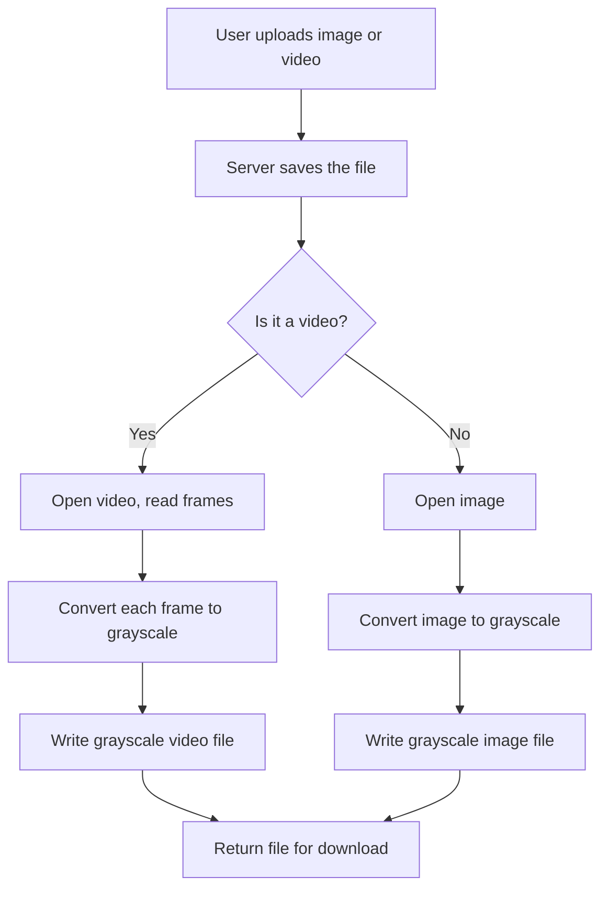

# Greyscale Conversion

Simple tool to turn pictures and videos into black-and-white (grayscale).

Easy summary for anyone:

- Use the web page to upload a photo or a video and download the grayscale result.
- Or run a small command to convert a video on your computer.

---

## Description

This small project converts color images and videos to grayscale (black-and-white). It's meant to be easy:

- Open the web page, upload a file, and download the converted result.
- Or run a single command to convert a video on your computer.

No technical knowledge required — just pick a file and press upload.

---

## Methodology

High-level steps the app follows (what happens after you upload):



That's it — OpenCV's `cvtColor` does the heavy lifting.

---

## How to use (super simple)

1. Run the web app and open it in your browser:

```bash
python app.py
# then open http://localhost:5000
```

2. Upload a photo or a video. The app will give you a grayscale file to download.

3. Convert a video from the command line:

```bash
python modified_greyscale_video.py input.mp4 output_gray.mp4
```

---

## Files you should know

- `app.py` — the small web app (upload and download).
- `modified_greyscale_video.py` — command-line video converter.
- `requirements.txt` — Python packages to install.

---

## Notes

- This project uses OpenCV to do the conversion.
- It keeps a tiny `uploads.db` for demo tracking; you can ignore or delete it if not needed.
- To add a screenshot, put an image at `images/demo.png` and the README will show it.

---

## Live demo

Try the hosted demo here:

https://greyscale-conversion-5.onrender.com

You can share this URL with others who just want the utility.
