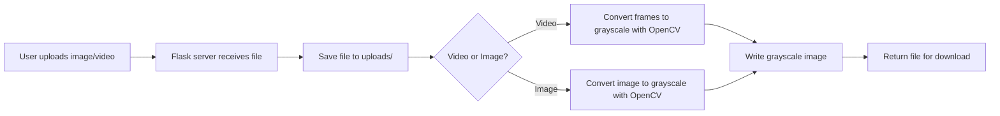

# Greyscale Conversion

A simple Python web app and utility that converts images and videos into grayscale using OpenCV. Upload a file through the web UI or run the CLI script to convert videos locally.

---

**Demo**

- Upload an image or a video using the web UI (runs on `http://localhost:5000`).
- The server returns a grayscale version for download.

(Place a screenshot at `images/demo.png` or `images/demo.gif` to show the UI.)



---

## Why this project

Greyscale conversion is a common image-processing step used in computer vision, previews, and artistic effects. This project demonstrates a lightweight, easy-to-use web interface and a small command-line script to convert media into grayscale using OpenCV.

---

## Features

- Web interface (Flask) for uploading images and videos and downloading converted files.
- CLI utility for converting local video files to grayscale.
- Saves converted outputs and tracks uploads in a tiny SQLite database for demo purposes.
- Minimal dependencies for easy deployment.

---

## Quick Start (Local)

1. Clone the repo:

```bash
git clone https://github.com/SagarDhillon01/Greyscale-Conversion.git
cd Greyscale-Conversion
```

2. Create a Python virtual environment and install dependencies:

```bash
python -m venv venv
# macOS / Linux
source venv/bin/activate
# Windows
# venv\\Scripts\\activate

pip install -r requirements.txt
```

3. Run the web app locally:

```bash
python app.py
```

Open http://localhost:5000 in your browser and upload an image or video.

To run with `gunicorn` (production-like):

```bash
gunicorn app:app --bind 0.0.0.0:8000
```

---

## CLI Usage (video conversion)

The file `modified_greyscale_video.py` provides a small command-line converter. Example:

```bash
python modified_greyscale_video.py input.mp4 output_gray.mp4
```

This script:
- Reads the input video.
- Converts each frame to grayscale with `cv2.cvtColor(..., cv2.COLOR_BGR2GRAY)`.
- Writes the output video using `mp4v` codec.

---

## How it works (simple explanation)

- For images: the app reads the image with OpenCV, converts BGR color pixels to grayscale by calculating luminance, and writes a JPEG/PNG grayscale file.
- For videos: it reads frames from the input video, converts each frame to grayscale, then writes frames back into a new video file preserving FPS and resolution.

Both conversions use OpenCV's optimized `cvtColor` routines for reliability and speed.

---

## Project structure

- `app.py` - Flask web application (upload endpoint, conversion logic, download)
- `modified_greyscale_video.py` - CLI video converter
- `templates/` - HTML templates for the web UI (index page)
- `requirements.txt` - Python dependencies (`Flask`, `gunicorn`, `opencv-python-headless`)
- `uploads.db` - small SQLite DB used by the demo app (tracked uploads)
- `uploads/` - runtime directory where uploaded and output files are stored

---

## Add screenshots / graphics

To make the README visual, add a screenshot of the UI at `images/demo.png` and reference it in this README. Example markdown to include after adding the file:

```markdown

```

If you prefer GIFs, put them at `images/demo.gif` and use the same markdown.

---

## Deployment

This app is lightweight and works on most hosts that support Python (Render, Heroku, Railway, etc.). Use the `requirements.txt` provided. For container deployment, create a small `Dockerfile` that installs Python, copies code, installs `requirements.txt`, and runs `gunicorn app:app`.

---

## Contributing

Contributions are welcome. Suggested minor tasks:

- Add tests for the conversion logic.
- Add upload size limits and validation for security.
- Add examples of different grayscale methods (luminosity, average).

Please open issues or pull requests with a short description.

---

## License

Add a license file (`LICENSE`) if you want to make this project open-source. If unsure, add an `MIT` license for permissive reuse.

---

## Contact

Created by SagarDhillon01. For questions or help, open an issue on GitHub.
